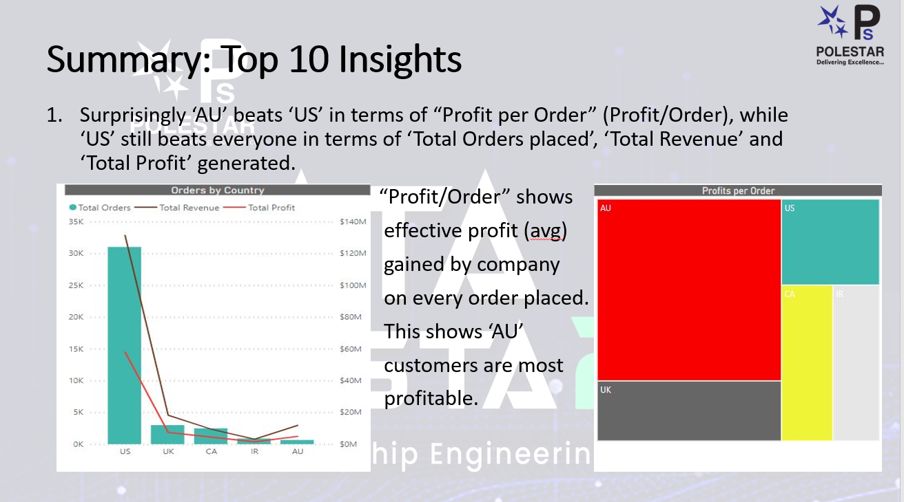
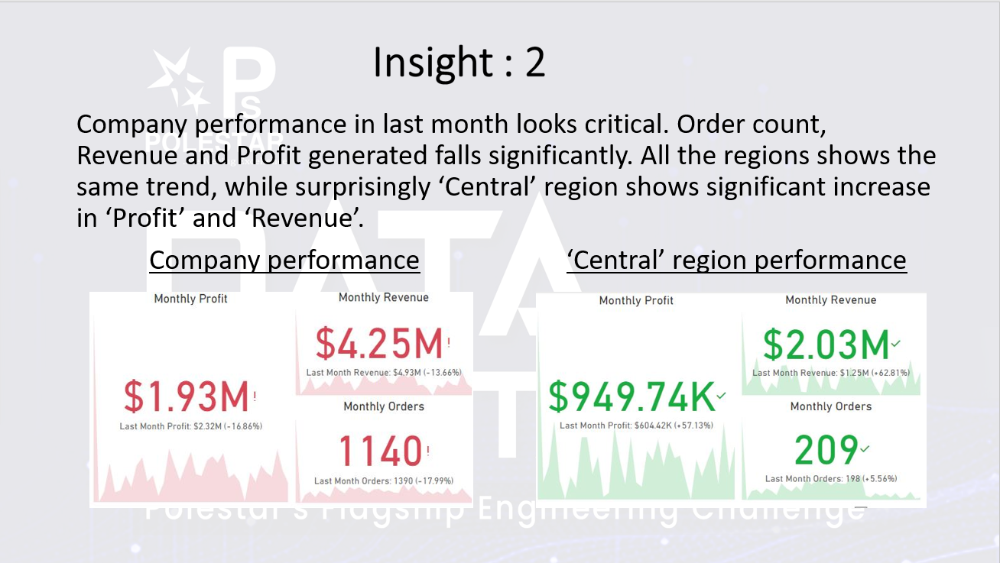
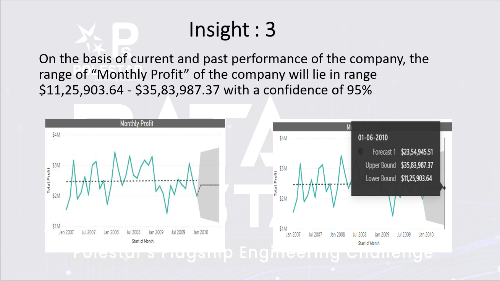

# Data-Fiesta-Hackthon
A data science hackathon project to draw top 10 insights from a number of bulk datasets.

### GOAL OF THE PROJECT
The goal of the project is to take out top 10 insights from the raw datasets.

## Understanding the problem statement
In this project , the given datasets are about the sales of  food and water by a company name ABC , customer details , product details , seles representative details
all over the world. 

## Preprocessing of the dataset
Going through extensive preprocessing part which is useful for drawing insights by  using pandas and numpy.

## Visualizing the dataset using POWER BI 
A lot of visualizations have been done by desgining the database schema. 

## Drawing Insights 
This is the most important part of the project , identifying the meaningful intuitions.

Some of the insights:-

  

  

  

